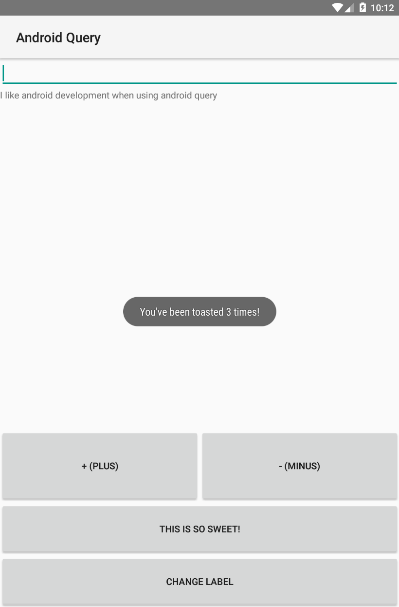

# Android Motion Query

`android_motion_query` was created to make android development on RubyMotion as enjoyable and productive as possible.
It also tries to make an android app look just like a ruby app, without losing any native functionality.

If you don't like dealing with XML layouts and long method names, `android_motion_query` might be for you.

`android_motion_query` was inspired by the wonderful [rmq](http://github.com/infinitered/rmq/) gem for iOS.

## Installation


Add this line to your application's Gemfile:

```ruby
  gem 'android_motion_query', '~> 0.0.7'
```

And then execute:

    $ bundle

Or install it yourself as:

    $ gem install android_motion_query

## Usage

The general rule is to create a top-level layout and add views to it.
Each view accepts a style method.

#### Tiny Example:

To create a LinearLayout and add a TextView widget to it:

```ruby
amq.linear_layout(:layout_style) do |my_layout|
  my_layout.text_view(:some_information)
end
```

The style for the LinearLayout is `:layout_style` and the TextView has a `:some_information` style.

How do you define styles?

Styles are defined in a separate class that inherit from `AndroidMotionQuery::Stylesheet`.

Each style is passed a wrapper of the android view:

```ruby
def layout_style(st)
  st.width = :mp # or :wc for MATCH_PARENT and WRAP_CONTENT respectively
  st.height = :mp # could also provide an integer to be set directly
  st.background_color = '#CF7D33' # or you can do :white, :black, :green, etc
  st.orientation = :vertical # or :horizontal
end

def some_information(st)
  st.width = :mp
  st.height = :wc
  st.text = 'Hello Android Motion Query'
  st.text_color = :blue
  st.text_alignment = :center # or :bottom, :top, :center_right, etc
  st.margin_top = 10
end
```


#### Complete Example:

```ruby
class MainActivity < AMQScreen
  def on_create(saved_state)
    amq.stylesheet = HomeStyle
    amq.linear_layout(:top_layout) do |top|
      top.image_button(:bench_button)
      top.image_button(:flower_button)
      top.linear_layout(:directions) do |direction_layout|
        direction_layout.text_view(:left_text)
        direction_layout.button(:right_button)
      end
    end
  end
  
  def coffee_message(view)
    amq.toast('This is a message for COFFEE LOVERS :)', gravity: :center)
  end
  
  def random_thing(view)
    puts "This should be printed when I click the button"
  end
  
  def another_toast(view)
    amq.toast("This is a purple", gravity: :top_right, length: :long)
  end
end
```

The previous code produces the following app:




The following is the `HomeStyle` class that styles the screen:
```ruby
class HomeStyle < AMQStylesheet
  def top_layout(st)
    st.width = :mp
    st.height = 0
    st.weight_sum = 4
    st.orientation = :vertical
    st.background_color = '#A87E54'
  end
  
  def bench_button(st)
    st.width = :mp
    st.margin_top = 10
    st.margin_bottom = 10
    st.background_image = 'bench' # <-- image is resources/drawable/bench.png
    st.click = :coffee_message
    shared_button_styles(st)
  end
  
  def flower_button(st)
    st.width = :mp
    st.background_image = 'flower'
    st.click = :random_thing
    shared_button_styles(st)
  end
  
  def shared_button_styles(st)
    st.height = 0
    st.padding = 0
    st.margin_left = 10
    st.margin_right = 10
    st.scale_type = :fit_xy
    st.weight = 1.5
  end
  
  def directions(st)
    st.orientation = :horizontal
    st.weight = 1
    st.weight_sum = 2
    st.width = :mp
    st.height = 0
    st.margin_top = 10
  end
  
  def left_text(st)
    st.weight = 1
    st.text = 'android_query is AWESOME!'
    st.text_alignment = :center
  end
  
  def right_button(st)
    st.weight = 1
    st.text = 'Click Me'
    st.click = :another_toast
    st.background_color = '#927FD5'
    st.text_color = :white
  end
end
```

## Todo List
- [ ] Refactor - create more "single responsibility" classes and have smaller functions (this will never be "done", it's just here as a constant reminder)
- [ ] Set automatic IDs for views
- [ ] Add wrappers for all built-in android widgets (currently android_query supports 5 widgets)
- [x] Add support for LinearLayouts
- [ ] Add support for RelativeLayouts
- [ ] Add support for FrameLayouts
- [ ] Add support for AbsoluteLayouts (worth it? AbsoluteLayout is deprecated a long time ago)
- [x] Add support for working with custom widgets/views (throught `aqv.new_view()`)
- [ ] Add support for `view.click { block of code }`
- [ ] Add support for @string values (strings.xml)
- [x] Add support for @drawable values (images in the resources/drawable directory)
- [ ] Add support for easy and quick animations
- [ ] Add support for rounded corners (first attempt failed, this is harder than I thought)

## Contributing

Bug reports and pull requests are welcome on GitHub at https://github.com/aesmail/android_query.

## License

The gem is available as open source under the terms of the [MIT License](http://opensource.org/licenses/MIT).
